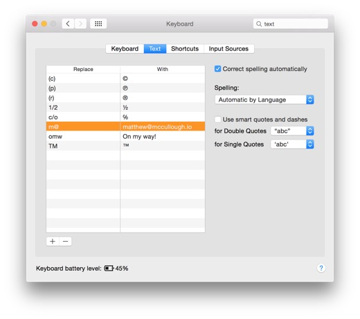
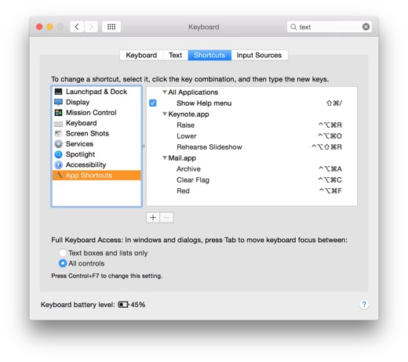
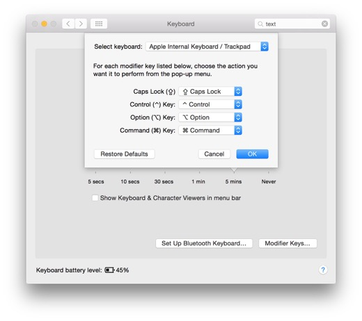

# Resources Guide  
for O'Reilly Media's [_Mac OSX Productivity Tips for Developers_](http://shop.oreilly.com/product/110000007.do) video course

## Introduction
* Apple supports the [Single UNIX Specification](http://www.unix.org/what_is_unix/single_unix_specification.html) and includes [POSIX Libraries](https://developer.apple.com/library/mac/documentation/Porting/Conceptual/PortingUnix/background/background.html#//apple_ref/doc/uid/TP40002848-TPXREF101).
* OSX includes [open source, such as the Apache web server, Ruby, Bash, and ZShell](https://www.apple.com/opensource/) out of the box.
* Many [system-wide keyboard shortcuts](http://support.apple.com/en-us/HT201236) are pre-configured.

## Keyboard Hacks

### Global text expansion
* Configured via _System Preferences_ → _Keyboard_ → _Text_

### Keyboard shortcuts
Configured via _System Preferences_ → _Keyboard_ → _Shortcuts_

### Modifier keys
Configured via _System Preferences_ → _Keyboard_ → _Modifer Keys_

### Keyboard acceleration in Safari
* [Type to Navigate](http://dbergey.github.io/) ([source code](https://github.com/dbergey/Type-To-Navigate)
* [Vimari](http://guyht.github.io/vimari/) ([source code](https://github.com/guyht/vimari)
* [gleeBox](http://guyht.github.io/vimari/)

## Terminal Tips
### Terminal Apps
* `Terminal.app` is built in to Mac OSX
  * Supports opacity
  * Easy [split panes](http://iterm2.com/features.html)
  * Minimal theme configuration
* [iTerm 2](http://iterm2.com/) is an alternative
  * [Open source](https://github.com/gnachman/iTerm2), [open project](https://code.google.com/p/iterm2/)
  * Profiles for window configuration
  * Scroll-back through history, even on remote machines
  * Cross-machine preference sharing
  * Configurable full screen behavior
  * Greater color selection
  * Configurable minimum contrast

### Shell enhancements
* [Git-core Git prompts](https://github.com/git/git/tree/master/contrib/completion)
* [Matthew's Bash prompts](https://github.com/matthewmccullough/dotfiles/blob/master/bash_gitprompt)
* [Oh-my-zsh Zsh prompts](http://ohmyz.sh/) [source code](https://github.com/robbyrussell/oh-my-zsh)

## Source Control Assistants
* [Tig](http://gitready.com/advanced/2009/07/31/tig-the-ncurses-front-end-to-git.html)
* [Hub Gem](http://hub.github.com)
* [Matthew's shell scripts]()

## File Formats
### Markdown
* [Markdown homepage](http://daringfireball.net/projects/markdown/)
* [GitHub Flavored Markdown](https://help.github.com/articles/markdown-basics/) ([source](http://github.github.com/github-flavored-markdown/))
* [Mastering Markdown Guide](https://guides.github.com/features/mastering-markdown/)
* [Markdown cheat sheet](http://markdown.chibi.io/)

### Asciidoc
* [Asciidoc Homepage](http://www.methods.co.nz/asciidoc/)
* [Asciidoctor project homepage](http://asciidoctor.org/)
* [Asciidoctor project code](https://github.com/asciidoctor)
* [Asciidoc support on GitHub](http://asciidoctor.org/news/2013/01/30/asciidoc-returns-to-github/)

### DocBook format
* [DocBook format](http://docbook.org/)
* [DocBook HowTo](http://ibiblio.org/godoy/sgml/docbook/howto/writing-docbook.html)
* [DocBook blog post: The minimum you need](http://shinysparkly.com/blog/2011/09/10/docbook-the-minimum-you-need/)

### Pandoc tool
* [Pandoc tool homepage](http://johnmacfarlane.net/pandoc/)
* [Pandoc source code](https://github.com/jgm/pandoc)
* [Pandoc definition](http://en.wikipedia.org/wiki/Pandoc)

## Package Management
* MacPorts
* Homebrew

## Searching with Spotlight
### Constraints
* `name:<phrase>`
* `kind:<type>`
* `date:<date>`
* `date:today`
* `date:>1/1/08`
* `modified:3/7/08-3/10/08`
* `created:=6/1/08`
* `AND`
* `OR`
* `NOT`

### Behavior modifiers
* `⌘⌥ <hover>`
* `⌘ <enter or click>`

## Viewing with Quicklook

## Moving with Finder

## Saving to the Cloud

## Web Service Helpers

## Pasteboard Command Line

## Shell Tune-Ups

## Display Control

## Applescript Automation

## Automator Apps

## Quick Directory Toggles

## Boxen - Part 01

## Boxen - Part 02

## Boxen - Part 03

## Boxen - Part 04

## Summary
